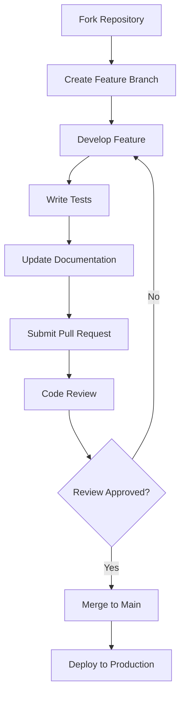

# Architecture Overview

This document provides a high-level overview of the 21.000.000 organization's technical architecture, project structure, and development philosophy.

## Organization Structure

The 21.000.000 organization follows a distributed repository model where each project serves a specific purpose in the Bitcoin ecosystem:

```
21-000-000 Organization
├── 21-000-000 (Main Repository)
│   ├── .github/ (Shared templates and workflows)
│   ├── docs/ (Organization-wide documentation)
│   ├── scripts/ (Administrative and setup scripts)
│   └── projects/ (Project overview and links)
├── awesome-btc-cz (Czech Bitcoin Resources)
├── awesome-btc-global (Global Bitcoin Resources)
├── 21-000-000.github.io (Community Website)
├── ai-tools (AI Development Tools)
└── dotfiles (Development Environment Configs)
```

## Repository Categories

### 🏛️ Core Infrastructure

#### 21-000-000 (Main Repository)
- **Purpose**: Organization documentation, governance, and shared resources
- **Architecture**: Static documentation repository with GitHub Actions
- **Key Components**:
  - Community guidelines and policies
  - Shared GitHub templates
  - Organization-wide documentation
  - Project coordination tools

#### 21-000-000.github.io (Community Website)
- **Purpose**: Public-facing community website
- **Architecture**: Static site generator (Jekyll/Next.js)
- **Key Components**:
  - Landing pages and project showcases
  - Blog and educational content
  - Community resources and links
  - SEO-optimized Bitcoin content

### 📚 Educational Resources

#### awesome-btc-cz (Czech Bitcoin Resources)
- **Purpose**: Curated Czech-language Bitcoin resources
- **Architecture**: Markdown-based resource collection
- **Key Components**:
  - Categorized resource lists
  - Community-maintained content
  - Translation and localization

#### awesome-btc-global (Global Bitcoin Resources)
- **Purpose**: International Bitcoin resource collection
- **Architecture**: Markdown-based with automated validation
- **Key Components**:
  - Multi-language support
  - Link validation system
  - Community contribution workflow

### 🛠️ Development Tools

#### ai-tools (AI Development Tools)
- **Purpose**: AI-powered tools for Bitcoin development
- **Architecture**: Microservices with API endpoints
- **Key Components**:
  - Bitcoin code analysis tools
  - Automated documentation generation
  - Development workflow automation

#### dotfiles (Development Environment)
- **Purpose**: Standardized development configurations
- **Architecture**: Shell scripts and configuration files
- **Key Components**:
  - Editor configurations (VS Code, Vim)
  - Git templates and hooks
  - Development environment setup

## Technical Standards

### Development Principles

1. **Open Source First**: All projects use permissive licenses (MIT/Apache)
2. **Security by Design**: Security considerations in every component
3. **Community Driven**: Transparent governance and contribution processes
4. **Educational Focus**: Code serves as learning material
5. **Bitcoin Values**: Decentralization, transparency, and financial sovereignty

### Code Quality Standards

#### Version Control
- **Git Flow**: Feature branches with pull request reviews
- **Commit Messages**: Conventional Commits specification
- **Branch Protection**: Required reviews and status checks
- **Semantic Versioning**: Clear version numbering for releases

#### Testing Strategy
- **Unit Tests**: Minimum 80% code coverage
- **Integration Tests**: End-to-end workflow validation
- **Security Tests**: Automated vulnerability scanning
- **Performance Tests**: Load testing for web applications

#### Documentation Requirements
- **README**: Clear setup and usage instructions
- **API Documentation**: OpenAPI/Swagger specifications
- **Code Comments**: JSDoc/Sphinx style documentation
- **Architecture Decisions**: ADRs for significant changes

## Infrastructure & DevOps

### Hosting & Deployment

```
Production Infrastructure
├── GitHub Pages (Static Sites)
│   ├── 21-000-000.github.io
│   └── Documentation sites
├── Vercel/Netlify (Dynamic Web Apps)
│   ├── API endpoints
│   └── Server-side rendering
└── GitHub Actions (CI/CD)
    ├── Automated testing
    ├── Security scanning
    └── Deployment workflows
```

### Security Architecture

#### Access Control
- **GitHub Teams**: Role-based repository access
- **Branch Protection**: Required reviews and status checks
- **Secret Management**: GitHub Secrets for sensitive data
- **2FA Requirement**: All organization members

#### Security Monitoring
- **Dependabot**: Automated dependency updates
- **CodeQL**: Static code analysis
- **Security Advisories**: Vulnerability disclosure process
- **Regular Audits**: Quarterly security reviews

## Data Architecture

### Content Management

#### Documentation
- **Format**: Markdown with frontmatter metadata
- **Validation**: Automated link checking and spell checking
- **Versioning**: Git-based version control
- **Translation**: i18n-friendly structure

#### Resource Collections
- **Schema**: Structured YAML/JSON for resource metadata
- **Validation**: JSON Schema validation
- **Search**: Full-text search capabilities
- **Categorization**: Hierarchical tagging system

### API Design

#### RESTful APIs
- **Standards**: OpenAPI 3.0 specifications
- **Authentication**: JWT tokens where needed
- **Rate Limiting**: Fair usage policies
- **Versioning**: URL-based API versioning

#### Data Formats
- **JSON**: Primary data exchange format
- **Markdown**: Human-readable documentation
- **YAML**: Configuration and metadata
- **CSV**: Bulk data import/export

## Development Workflow

### Contribution Process



### Release Management

1. **Development**: Feature branches merged to `main`
2. **Staging**: Automated deployment to staging environment
3. **Testing**: Community testing and feedback
4. **Release**: Tagged releases with changelog
5. **Production**: Automated deployment to production

## Monitoring & Analytics

### Performance Metrics
- **Website Analytics**: User engagement and traffic
- **Repository Metrics**: Contribution and activity tracking
- **Code Quality**: Test coverage and security scores
- **Community Health**: Issue resolution and response times

### Alerting
- **Build Failures**: Immediate notification to maintainers
- **Security Issues**: Automated security advisory creation
- **Performance Degradation**: Monitoring service alerts
- **Community Issues**: Escalation for urgent matters

## Future Architecture Plans

### Upcoming Enhancements

1. **Microservices Migration**: Breaking monolithic applications into services
2. **API Gateway**: Centralized API management and authentication
3. **Search Enhancement**: Elasticsearch for better content discovery
4. **Mobile Applications**: Native apps for key community tools
5. **Blockchain Integration**: Direct Bitcoin network interaction tools

### Scalability Considerations

- **CDN Integration**: Global content delivery for better performance
- **Caching Strategy**: Redis for frequently accessed data
- **Database Optimization**: Efficient data storage and retrieval
- **Load Balancing**: Horizontal scaling for high-traffic periods

---

This architecture supports our mission of building an open, educational, and secure Bitcoin community ecosystem. Each component is designed to be maintainable, scalable, and aligned with Bitcoin's core principles of decentralization and transparency.

